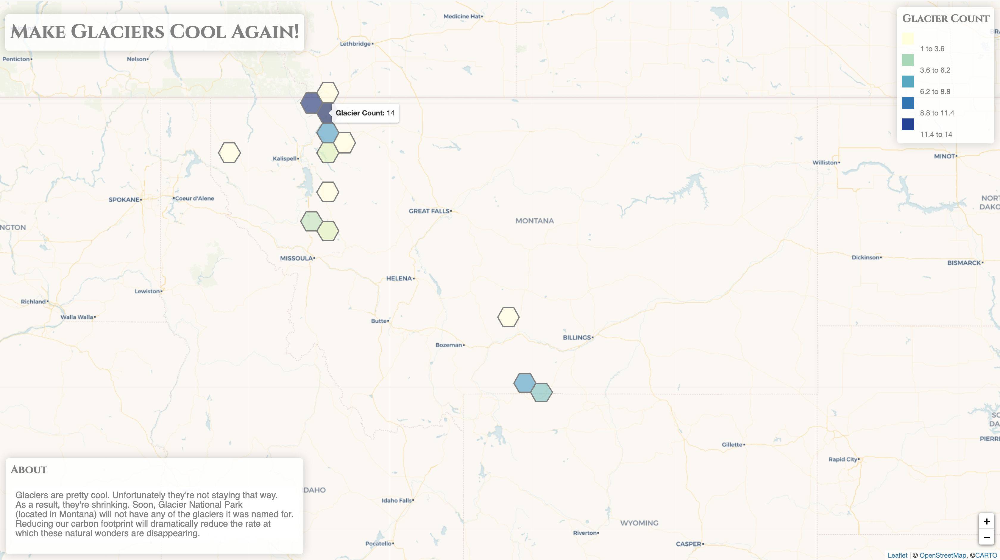

# Scripts

"I'm in love with Montana. For other states I have admiration, respect, recognition, even some affection. But with Montana, it is love. And it's hard to analyze love when you're in it" 
John Steinbeck

Glacier National Park is located in northwestern Montana, and is the inspiration for my exploration of this dataset. Montana, and Glacier National Park have left an indelible mark on me. I hope to share my love for it, and inspire others to visit the park as well. 

## Data Aquisition

I obtained the GNIS data here:
https://www.usgs.gov/core-science-systems/ngp/board-on-geographic-names/download-gnis-data 

The Montana shapefile was downloaded from here:
https://www.census.gov/geographies/mapping-files/time-series/geo/carto-boundary-file.html

## Data Cleaning

I used the following mapshaper command to simplify and filter to Montana, and export the result to GeoJSON. 

`mapshaper cb_2018_us_state_500k.shp -filter STATEFP=='30' -simplify dp 15% -proj wgs84 -o precision=.00001 format=geojson mt-state.json`

I then used the process-csv.js script to filter the GNIS data to reflect the Feature Class "Glacier" located in Montana. After the mt-glaciers.json was created I used that file within the create-hex.js script to create a hexbin map reflecting glacier locations/density in Montana.

## Data Visualization

### mt-glacier-hexgrid.html

This file uses the mt-hexgrid-glaciers-15.json created with the create-hex.js script to provide visual represntation of glaciers across Montana. As the map displays, the highest density of glaciers is located within the parks boundaries. 

### index-bearing.html

This file displays glacier locations as leaflet markers and a centroid marker for the center of Montana. When the user clicks on a glacier marker, the bearing from the Montana's centroid to the selected marker is displayed.